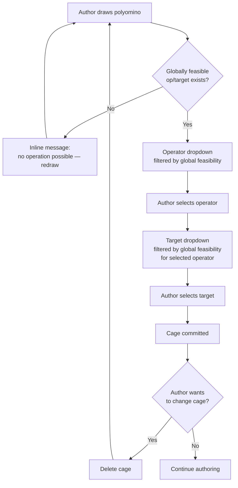

# ADR-0001: Without-Solution authoring mode for Mathdoku Designer

**Status:** Proposed
**Date:** 2026-05-27
**Deciders:** Bill McNeill (Mathdoku owner)

## Context

Mathdoku Designer currently supports a single authoring flow. On new-puzzle creation, a random Latin Square is generated and stored in `State.solution` (`mathdoku-designer/shared/src/lib.rs`). The author then designs cages by drawing polyominos and selecting operators; the target value for each cage is computed from the fixed solution. The solution acts as a guide rail — every cage the user commits is feasible by construction, and the UI surfaces the solution value in green inside each cell to keep the author oriented.

This flow does not cover a second style of authoring in which the author has target values in mind and wants to specify operators *and* targets directly, letting the solution emerge from the constraints rather than precede them. Without a solution to read targets off of, the author needs the system to tell them which (operator, target) pairs are feasible for each polyomino given the rest of the puzzle. Local feasibility (the region in isolation under row/column Latin constraints) is insufficient: an (op, target) that admits a cell assignment in isolation may have no global completion once other cages are present, leaving the author free to trap themselves several commits later.

The puzzle is therefore: support a second authoring mode that surfaces only globally-feasible (op, target) pairs to the author, reusing the existing solver machinery where possible, without introducing new invalid-state UI or new save-format complexity.

## Decision

Add a second authoring mode — **Without Solution** — alongside the existing **With Solution** mode. The new-puzzle modal exposes two buttons (*Empty* and *With Solution*) and the choice is fixed at puzzle creation.

The `solution` field on `State` becomes `Option<Grid>`. `Some` denotes With-Solution mode; `None` denotes Without-Solution mode. A `mode` discriminator on `State` is not required — the `Option` carries the same information — but is added if UI code finds it more ergonomic than matching on `solution`.

Without-Solution mode enforces **maximally-strict** semantics: every operator and target choice an author makes is taken from a dropdown filtered by global feasibility of the candidate cage against all already-committed cages. The author cannot commit a cage that leaves the puzzle without a global completion, and an already-committed cage cannot become globally infeasible through any subsequent action. Region edits to a committed cage are not a primitive operation; the author deletes the cage (a "delete cage" affordance is prerequisite work, added before this mode begins) and redraws it.

Feasibility queries reuse the existing solver. `Grid::solutions(&puzzle)` already returns a solution iterator built on `Mdd::support` propagation (`mathdoku/src/mdd.rs` and `mathdoku/src/grid_csp.rs`); a feasibility query is `iter.next().is_some()` on a puzzle extended with the candidate cage. Dropdown population enumerates all (op, target) pairs whose extended puzzle admits at least one completion. No parallel solver is introduced.

Mode switching is supported via two operations on `State`: `fix` (Without-Solution → With-Solution, legal only when the puzzle has exactly one global completion, snapshots that completion into `solution`) and `unfix` (With-Solution → Without-Solution, drops `solution`).

## Options Considered

### Option A: Maximally-strict Without-Solution mode with `Option<Grid>` state — *chosen*

| Dimension | Assessment |
|-----------|------------|
| Complexity | Medium — concentrated in the dropdown query and its cache |
| Performance budget | Tight — dropdown population is the hot path |
| Type-safety win | Moderate — `Option` is honest about which mode the state is in |
| Save/IPC churn | Low — `Option<Grid>` is a serde-compatible field change |
| Component churn | Low — Cell and OperationSelector already accommodate the absence of a solution value |

**Pros:** No code path can land the puzzle in a globally-infeasible state. Solution-count component is purely informational (1 / few / many) — no zero-solutions branch to handle. No "this cage is invalid" UI, no minimal-unsatisfiable-subset heuristics, no save guard. Save format gains one `Option` field. Mode switching is two trivial state transformations.

**Cons:** Dropdown population must be correct before the author sees it, so it cannot be made async-stale. The dropdown query is heavier than any existing query in the Designer. Authors who want to investigate "why isn't this (op, target) available?" have no built-in tooling — they delete a cage and check whether the choice reappears.

### Option B: Two distinct State types

Split `State` into `StateWithSolution` and `StateWithoutSolution` with a shared core and the former adding a `solution: Grid` field. The IPC layer carries an enum-tagged variant; undo/redo and save/load fork on the variant; functions either take one variant, take both via trait, or take the common core.

| Dimension | Assessment |
|-----------|------------|
| Complexity | High — touches every consumer of `State` |
| Type-safety win | High — `solution` is statically unreachable in Without-Solution code paths |
| Save/IPC churn | High — forked serde representation |
| Component churn | High — Cell and OperationSelector parameterise over the variant |

**Pros:** Strongest possible static guarantee that the solution field is unreachable in Without-Solution mode. Compiler-enforced separation of mode-specific logic.

**Cons:** Lift is disproportionate to the scope of code that actually cares about the distinction (a handful of sites in Cell rendering and target computation). Undo/redo, save/load, and IPC all gain enum-shaped boilerplate. Mode switching becomes a translation between distinct types rather than a field mutation.

### Option C: Permissive invalidation with per-cage "invalid" UI

Allow the author to make choices that invalidate previously-committed cages. Mark affected cages with a red border and warning icon, block save while any cage is marked invalid, optionally compute a minimal unsatisfiable subset to highlight likely culprits.

| Dimension | Assessment |
|-----------|------------|
| Complexity | High — invalid-state visuals, MUS computation, save guard |
| Author experience | Mixed — supports fluid experimentation but lets the puzzle drift into invalidity |
| New solver work | Minimal-unsatisfiable-subset computation is non-trivial and not unique |

**Pros:** Author can experiment freely, leaving the puzzle in an invalid state temporarily and resolving later.

**Cons:** Invalidity is a global property — there is no canonical "which cage is wrong" — so any per-cage indicator is a heuristic blame call. Solution-count component gains a zero-solutions branch. Save format gains a "has unresolved invalidities" flag. The author can ship invalid puzzles by ignoring the warnings.

### Option D: Local-only feasibility

Filter the dropdown by feasibility of the candidate cage in isolation under row/column Latin constraints, ignoring other cages.

| Dimension | Assessment |
|-----------|------------|
| Performance | Excellent — per-region-shape result is cacheable |
| Correctness | Insufficient — does not prevent global infeasibility |

**Pros:** Fastest possible dropdown population. Cache is keyed on region shape alone.

**Cons:** Defeats the purpose of Without-Solution mode. An author can commit a sequence of locally-feasible cages whose conjunction has no completion, then discover at solve time that the puzzle is broken. The system would either accept invalid puzzles silently or fall back to per-cage "invalid" UI on every commit — recreating the problems of Option C.

### Option E: Parallel MDD-based feasibility engine

Build a global MDD over the whole puzzle (rather than per-cage) and query it for feasibility. Reuse none of `grid_csp` or `Grid::solutions`.

| Dimension | Assessment |
|-----------|------------|
| Complexity | High — second solver to maintain |
| Performance | Possibly better for repeated queries; possibly worse for ad-hoc edits |

**Pros:** A global MDD admits richer queries (project onto a region, enumerate supports) in one traversal once built.

**Cons:** Mathdoku's existing CSP/solver pipeline is per-cage MDDs composed via generalized arc consistency, not a single global MDD. Maintaining two engines in parallel doubles the surface for bugs and divergence. The single-completion question that Without-Solution mode needs is already answered by `Grid::solutions(&puzzle).next().is_some()` with early exit.

## Trade-off Analysis

Option A trades a sharp performance constraint on dropdown population for a clean state model and a simple UI. The constraint is real but localized: only one query in the system has to be fast, and it has a clear cache key (the set of committed cages plus the candidate). The state-model and UI savings cascade — no zero-solutions branch in `SolutionCount`, no invalid-state visuals, no save guards, no MUS, no permissive-edit affordances.

Option B trades extensive structural churn for a static guarantee that addresses a small attack surface. The number of code sites that actually distinguish modes is small (Cell rendering, target computation, the new-puzzle modal, save/load). An `Option<Grid>` with a constructor guarantee on `Mode` consistency catches the same bugs at runtime with negligible test cost.

Option C trades a clean invariant for author flexibility that has no clear use case. The author's natural workflow does not require leaving the puzzle invalid; "experiment freely" is better served by undo than by permissive invalidity. The downstream cost — MUS heuristics, blame UI, save guard — is large and serves a narrow benefit.

Option D is rejected on correctness grounds.

Option E is rejected because the question Without-Solution mode actually asks ("does at least one completion exist?") is already cheap to answer in the existing engine, and a parallel implementation invites divergence bugs.

## Consequences

### What becomes easier

`State` carries one consistent shape across both modes; save format gains one `Option` field; undo/redo, save/load, and IPC are unaffected by the mode split. `Cell` and `OperationSelector` need no new types — Cell already accepts `Option<u8>` for the solution value, and OperationSelector already renders an operator-only fallback when domains aren't singletons. `SolutionCount` is informational only. Mode switching is two field mutations.

### What becomes harder

Dropdown population in Without-Solution mode is the heaviest single query in the system: it enumerates all globally-feasible (op, target) pairs for the candidate region against all committed cages. The query must complete before the author sees the dropdown — no async-stale fallback. A spinner is acceptable for v1; a region-selection prefetch is added if profiling shows the spinner becomes a visible wait.

`OperationSelector` gains two new branches usable only in Without-Solution mode: a target-picker dropdown shown after an operator is clicked, and an empty-state message ("no operation possible — redraw region") for polyominos that admit no globally-feasible (op, target) pair. The empty state is unreachable in With-Solution mode (singletons always admit `Given`, multi-cell regions always admit `Sum` against a fixed Latin Square) and is cfg-gated to Without-Solution rendering.

Region edits on committed cages are no longer supported. The author deletes and redraws. A "delete cage" affordance is prerequisite work, completed before Without-Solution mode lands.

### What we'll need to revisit

The feasibility-query cache shape is provisional: a coarse cache keyed on `(committed-cage-set version, candidate region, operator, target)` with version-bump invalidation on any commit. If profiling shows the cache miss rate is high or the cache memory footprint is excessive, the shape is revisited — possibilities include caching just yes/no per (op, target), caching enumerated supports per region, or sharing MDD layers across cage-set prefixes.

Investigation tooling — "why is this (op, target) unavailable?" — is explicitly out of scope. Authors investigate by deleting cages and observing whether the desired choice reappears. If this becomes a frequent ask, a later version adds a minimal-unsatisfiable-subset diagnostic on demand, surfaced as an opt-in command rather than always-on UI.

The flow diagram below describes the cage-commit lifecycle under Without-Solution semantics; it is the contract that the chosen option must preserve.

## Action Items

1. [ ] Add the "delete cage" affordance to Designer (prerequisite, independent of mode split).
2. [ ] Change `State.solution` from `Grid` to `Option<Grid>` in `mathdoku-designer/shared/src/lib.rs`; update `State::new` and all `State` consumers.
3. [ ] Add the two-button new-puzzle modal (*Empty* / *With Solution*) and wire it through to `State` construction.
4. [ ] Thread `Option<u8>` (rather than `u8`) for `solution_value` through `Cell` for the Without-Solution branch; confirm the existing `Cell` rendering already handles `None`.
5. [ ] Extend the feasibility query: a helper on `PartialSolution` (or a new module) that takes a candidate `(Polyomino, Operator, target)` and returns a bool by extending the puzzle and consuming the first item of `Grid::solutions(&puzzle)`.
6. [ ] Extend the dropdown query: enumerate all globally-feasible `(op, target)` pairs for a candidate region against the current cage set. Decide between one composite call and per-pair calls based on engine ergonomics.
7. [ ] Add a coarse cache for dropdown query results keyed on `(committed-cage-set version, candidate-region cells)`, returning the full set of feasible `(op, target)` pairs. Invalidate on every commit.
8. [ ] Add the target-picker dropdown branch to `OperationSelector` (`mathdoku-designer/src/components/operation_selector.rs`); add the empty-state inline message, cfg-gated to Without-Solution mode.
9. [ ] Add `fix` and `unfix` as `State` methods; gate `fix` on `solution_count == 1`.
10. [ ] Confirm `SolutionCount` (`mathdoku-designer/src/components/solution_count.rs`) needs no behavioural change beyond removing any latent zero-solutions assumptions, since the invariant guarantees `count >= 1` in Without-Solution mode.
11. [ ] Add the spinner on dropdown open; do not implement prefetch unless a follow-up profiling pass shows it is needed.
