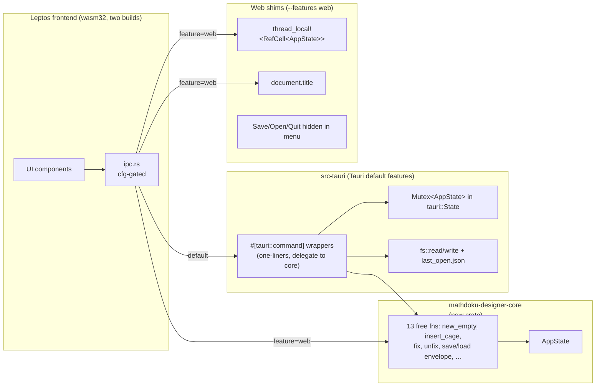

# ADR-0002: WASM web preview architecture for Mathdoku Designer

**Status:** Accepted
**Date:** 2026-05-27
**Deciders:** Bill McNeill (Mathdoku owner)

## Context

Mathdoku Designer ships as a Tauri 2 app for macOS and Linux. Release-plan Phase 7 calls for a public website on GitHub Pages with a *try-in-browser* page, and Phase 8 calls for the same WASM bundle to power per-branch PR previews so UI changes can be reviewed in a browser without a local build. The earlier branch-deploy investigation already settled the high-level path: **WASM-everything**, no HTTP backend, no second protocol. This ADR locks in the structural details that decision left open.

The frontend in `mathdoku-designer/src` is a Leptos-CSR application compiled to `wasm32-unknown-unknown` and bundled by Trunk. Today it runs only inside the Tauri webview. Application state lives in `src-tauri` behind a `Mutex<AppState>` registered as `tauri::State`, mutated by thirteen `#[tauri::command]` functions in `src-tauri/src/commands.rs`. The frontend reaches those commands via `window.__TAURI__.core.invoke` through the centralized wrappers in `src/ipc.rs`. A vanilla browser tab has no Tauri runtime; calling `invoke` there throws.

The puzzle is therefore: give the existing frontend a second backend path that runs entirely inside the WASM bundle, without forking the command bodies, without giving every component a feature-flag-aware code path, and without committing to a heavier separation (a trait abstraction, an HTTP shim, a separate "web" frontend codebase) than the demo actually warrants.

A few constraints frame the answer. The web preview is a *demo* — it must let a visitor draw a puzzle and exercise the authoring UI, but it does not need to save, load, or remember anything across reloads. Native ergonomics (file dialogs, last-opened file, OS window title) must stay native; the web equivalent is the absence of those features, not a polyfill of them. And the website framework that hosts the `/try` page is still undecided (Phase 7 open question), so the integration mechanism must not depend on which framework wins.

## Decision

Create a new workspace crate, `mathdoku-designer-core`, that holds today's thirteen command bodies as ordinary free functions taking `&mut AppState`. `AppState` itself moves into this crate. Both backends — the native Tauri build and the web build — depend on the core crate; both own an `AppState`; the only thing that differs between them is how that `AppState` is held and how the frontend reaches the functions that mutate it.

`mathdoku-designer/src/ipc.rs` becomes a thin cfg-gated dispatcher. Under the default Cargo features it keeps today's `raw_invoke`-based wrappers. Under `--features web` (and only then) it calls the core functions directly against a `thread_local!<RefCell<AppState>>` singleton living in the frontend crate. The choice is a build-time switch; the same source tree produces two distinct WASM bundles.

The web bundle is deliberately stripped of every operation that has no honest in-browser equivalent. The Save and Open menu entries are hidden, not shown-and-disabled. `quit_app` is hidden the same way. `set_window_title` is implemented against `document.title`. There is no `localStorage` persistence: the visitor's puzzle is ephemeral, and reloading the tab starts over. This is a UX statement — *come try it; if you want to keep what you made, download the app* — not a temporary deficit. The save/load shims discussed in the earlier branch-deploys investigation are explicitly deferred; the door is left open by keeping the envelope-serialization helpers in the core crate, where a future shim would attach.

Deployment uses GitHub Pages as the single host, organized as two categories of GitHub Environment. The canonical `/try` page is the `main` environment, rebuilt on every push to `main`. Each open pull request gets its own preview environment named `pr-NNN`, published under `/pr-NNN/`. A workflow on `pull_request` events (`opened`, `synchronize`, `reopened`) builds the WASM bundle with `--features web` and publishes it to the matching environment, which decorates the PR conversation with a clickable preview URL. A companion workflow on `pull_request: closed` deletes the `/pr-NNN/` directory from the gh-pages branch and marks the environment inactive, so closed PRs do not accumulate.

Using the PR number as the URL segment sidesteps branch-name sanitization entirely — PR IDs are numeric and slash-free. Branch identity stays a metadata attribute of the PR, not a URL component.

The website's `/try` page is an HTML shell that embeds the Trunk-generated `index.html` inside an `<iframe>`. The shell owns chrome (page title, "this is a demo, download for save/load" banner, link back to the project); the iframe owns the canvas. This decouples Phase 8 from the still-open Phase 7 framework choice — whether the website ends up on mdBook, Astro, Zola, or plain HTML, the shell is the same five lines of markup.

Bundle-size budget is set at **≤ 2 MB brotli-compressed** for the first-paint WASM artifact, enforced as a CI check on the web build from day one. The number is chosen deliberately, not as a placeholder: 2 MB is generous enough that a stock Trunk release of Leptos plus the solver should clear it without contortion, and tight enough to catch any 3-5× regression from an accidental heavyweight dependency. If the gate trips, the response is to optimize (wasm-opt `-Oz`, brotli precompression, lazy-load heavier components), not to raise the number.

## Options Considered

### Option A: Portable core crate + cfg-gated `ipc.rs` + GH Pages environments — *chosen*

| Dimension | Assessment |
|-----------|------------|
| Complexity | Medium — one new crate, one feature flag, two `AppState` ownership stories |
| Lift to first preview | Low — extraction is mechanical; command bodies are already small and dependency-free |
| Native disruption | None — `src-tauri` keeps owning its `AppState`, command bodies move but signatures don't |
| Build matrix | Two builds (Tauri default, `--features web`); both must pass CI |
| Drift risk | Low — there is exactly one implementation of each command body |

**Pros:** Single source of truth for command logic. Native and web stay in lockstep because they call the same functions. Tauri's command surface stays the same — `#[tauri::command]` wrappers shrink to one-liners that lock the mutex and delegate. The web build's WASM bundle carries only the code it actually runs (the native frontend bundle has no web-shim code, and vice versa). The frontend stays one codebase; cfg-gating is concentrated in `ipc.rs` and a small `web_shims.rs`.

**Cons:** `AppState` lives in two containers (`Mutex<AppState>` on native, `thread_local!<RefCell<AppState>>` on web). The two ownership stories must both be maintained, and contributors touching `AppState` need to understand both. CI runs two builds, not one. The Cargo-feature switch is a build-time choice — a single binary cannot decide at runtime which backend to use.

### Option B: HTTP backend

A small Axum or actix server holds `AppState` and serves the same thirteen commands over JSON-RPC. The frontend's `ipc.rs` has a cfg branch that talks HTTP in web mode and Tauri in native mode.

| Dimension | Assessment |
|-----------|------------|
| Complexity | High — new server, new deploy story, two wire protocols |
| Ongoing cost | High — every command change touches two protocols and their tests |
| Deploy cost | A server to host, a domain, TLS, scaling somebody else's puzzles |

**Pros:** Web preview is "real" — same code path as a hypothetical hosted product, including any future multi-user behavior.

**Cons:** Designer is deterministic computation over local state. There is no server-side reason for the state to leave the visitor's browser, and shipping it to one introduces a permanent dual-protocol cost (Tauri IPC + HTTP), latency the WASM path would not have, and a hosted service for what was meant to be a free static demo. Rejected for the same reasons captured in the branch-deploys memory.

### Option C: Runtime detection of `window.__TAURI__`

One bundle, no Cargo feature. `ipc.rs` checks at call time whether Tauri is present, calls `raw_invoke` if so, otherwise calls the core function directly. The frontend ships a single WASM artifact usable as either a Tauri webview payload or a standalone page.

| Dimension | Assessment |
|-----------|------------|
| Complexity | Low — one branch in each wrapper |
| Bundle size | Worse — every artifact carries both code paths |
| Test surface | Same artifact behaves differently in two environments; harder to reason about |

**Pros:** One build, one artifact, one CI job. Trivial deployment story.

**Cons:** The native Tauri bundle carries the web shims as dead weight, and the web bundle carries the `invoke` glue as dead weight. The artifact's behavior depends on its runtime environment, which makes "what does this binary do" a harder question than it needs to be. Also forces the web build to ship code that calls `wasm-bindgen` into Tauri-only JS bindings — those declarations exist whether or not they're reached. The bundle-size hit is small in absolute terms, but the cost is permanent and asymmetric: native users (the primary audience) pay for the web demo.

### Option D: `DesignerBackend` trait with runtime polymorphism

`ipc.rs` exposes a `trait DesignerBackend` with thirteen methods; the frontend holds a `Box<dyn DesignerBackend>`; native instantiates a `TauriBackend`, web instantiates a `WasmBackend`.

| Dimension | Assessment |
|-----------|------------|
| Complexity | High for the benefit |
| Polymorphism need | Zero — the choice is build-time |

**Pros:** Type-checked separation; could in principle support a third backend (HTTP, test mock) by adding an impl.

**Cons:** Designer never needs to swap backends at runtime. A trait introduces vtable indirection, async-fn-in-trait gymnastics for thirteen IPC methods, and an extra abstraction layer over what is fundamentally `#[cfg]`-time dispatch. Rejected in the prior branch-deploys investigation and re-rejected here for the same reason.

### Option E: WASM-everywhere, Tauri shell for I/O only

Move all of `AppState` into the frontend on both targets. The native Tauri commands shrink to four (`save_file`, `load_file`, `set_window_title`, `quit_app`); everything else runs in the webview's WASM. Web build has no Tauri at all and reuses the same frontend state.

| Dimension | Assessment |
|-----------|------------|
| Complexity | High one-time, lower steady-state |
| Architectural shift | Large — inverts where state lives on native |
| Bundle size on native | Larger native frontend bundle (now contains command bodies) |
| Persistence model | Frontend state vanishes on webview reload — needs explicit save/load on every change to keep parity with today's behavior |

**Pros:** The cleanest decomposition; Tauri reduces to plumbing. The native and web builds share not just command bodies but the entire state-management approach.

**Cons:** Today's design relies on the Rust process surviving webview reloads — `AppState` outlives any one render. Moving state into the frontend means a webview reload loses the puzzle unless we write to disk on every mutation. That works, but it is a real architectural change to native semantics in service of cleaner web semantics, and it expands the scope of Phase 8 from "add a web preview" to "rebuild the native state model." Deferred; can be revisited later if the dual-`AppState` ownership cost in Option A becomes annoying.

### Sub-option: PR preview hosting (Vercel / Cloudflare Pages / GH Pages plain subpath / GH Pages environments — *chosen*)

GH Pages **environments** with the Deployments API: each open PR gets its own `pr-NNN` environment with a clickable preview URL on the PR conversation, plus a `main` environment for the canonical `/try` page; PR close triggers cleanup; everything stays inside GitHub. GH Pages **plain subpath-per-PR** is simpler workflow code but skips the GitHub Environments UI — no per-PR check on the conversation, no dashboard of active previews.

**Vercel** and **Cloudflare Pages** are the natural reach-for here. Both automate every part of this — per-PR preview URLs, click-through checks on the PR conversation, comment-bot, automatic cleanup on PR close — and would collapse the three workflows GH Pages requires into a one-time project-connection step. Both are free for OSS. They were reconsidered explicitly and rejected: the value of keeping the project on a single platform (GitHub) outweighs the saved YAML. Each additional hosting provider adds an account, a control plane, a billing relationship (even when today's bill is zero), and one more place for things to break unsupervised. For a single-maintainer OSS project that overhead compounds faster than the per-task automation savings. The GH Pages workflows are tedious but bounded — three YAML files written once, touched rarely.

### Sub-option: `/try` integration (iframe — *chosen* — vs asset pipeline)

The website's `/try` page is one HTML file containing an `<iframe>` pointing at the Trunk-generated bundle's `index.html`. Trunk emits hash-named JS/WASM assets and an `index.html` that knows how to load them; iframing means we don't have to teach the website framework about those hashed names. The alternative — inlining Trunk's asset references into a page rendered by the website framework — couples the website build pipeline to Trunk's output naming, which would force a rebuild of the website on every change to the WASM bundle even if the page chrome around it didn't change. Iframe is the loose-coupling choice; deferred until measured to be a problem.

## Trade-off Analysis

Option A is the smallest move that satisfies Phase 8. The thirteen command bodies are already small, dependency-free, and well-typed against `AppState`. Pulling them into a sibling crate is a mechanical refactor that leaves `src-tauri` looking exactly like itself with one-line `#[tauri::command]` wrappers, and gives the web build a real first-class backend rather than a partial polyfill.

Option A's real cost — the dual `AppState` ownership — is concentrated in two files (`ipc.rs` and a new `web_shims.rs`) and is invisible to the rest of the frontend, which keeps calling the same wrapper functions regardless of backend. The cost is paid once and forgotten; it does not grow with the number of command bodies.

Option C trades that one-time cost for a permanent asymmetric bundle-size tax on the native build. The web preview is the secondary deliverable; making the primary deliverable carry its weight is the wrong direction.

Option E is the structurally cleanest answer but rewrites native state semantics to fix a web problem. If we ever do that rewrite, it should be on its own merits, not as a Phase 8 dependency.

GH Pages environments cost a few hours of workflow plumbing and pay back with branch-level previews in the GitHub UI for as long as the project exists. The cleanup workflow is the only delicate part; sanitizing branch names and deleting on branch-delete events is a small, well-understood ops pattern.

Iframing the `/try` page costs nothing in either bundle size or perceived latency for the visitor (the WASM bundle is the dominant load and would be the same either way) and is the only choice that survives any decision about the website framework.

## Consequences

### What becomes easier

Phase 7's `/try-in-browser` page is two files: the iframe shell and the Trunk-built bundle it embeds. The website-framework decision (mdBook / Astro / Zola / plain HTML) no longer constrains Phase 8.

PR reviews stop requiring a reviewer to check out the branch and run `npm run tauri dev`. A link in the PR conversation opens the change in a real browser.

The library's API audit (Phase 2) keeps its existing audience model — *the Designer is just another `mathdoku` consumer* — because the portable core crate consumes `mathdoku` through the same public surface that downstream users will.

Tauri command bodies become trivial. `#[tauri::command] fn insert_cage(…) -> Result<State, String> { core::insert_cage(&mut state.lock()?, …).map_err(|e| e.to_string()) }`. Reviewing a change to designer logic means reading one file in the core crate, not chasing it across two protocol layers.

### What becomes harder

`AppState` lives in two containers across two backends. A contributor adding a command writes one core function and two thin wrappers (Tauri command + web `ipc.rs` branch). Forgetting one is caught by CI's two-build matrix, but it's a real ergonomic tax.

Cargo's feature unification means the workspace cannot have anything that pulls in `--features web` transitively from a native build path. The feature must stay namespaced to the frontend crate and inert in the workspace's default build graph. This is an enforceable discipline (a CI job that builds the workspace with no extra features and confirms `web` is not active), but it is discipline.

The web build's "no save, no load" stance is a UX statement that has to be visible. The Try page banner copy ("ephemeral demo — install the app to keep what you make") needs to land before the page goes public, or first-time visitors will lose work and feel cheated.

Phase 7's website framework choice inherits a hard constraint from this decision. The website, the Designer canonical build at `/main/`, and the per-PR previews at `/pr-NNN/` all coexist on the same `gh-pages` branch — the website writes to root, the Designer deploys write to their own subtrees, and each uses `keep_files: true` so the three deploys do not wipe each other. This rules out any framework whose deploy step assumes ownership of the whole branch, and rules out GitHub's official `actions/deploy-pages` (which does atomic single-artifact uploads). Static site generators (mdBook, Astro, Zola, plain HTML) are compatible as long as their deploy step uses `peaceiris/actions-gh-pages` with `keep_files: true`.

### What we'll need to revisit

Persistence on web is deliberately deferred. If telemetry or feedback shows that visitors are losing valuable work, the door is open: the core crate already owns the envelope-serialization helpers, and a `localStorage` shim attaches to them without changing the command surface. Blob-download save and file-picker load follow the same pattern.

The 2 MB brotli budget is a deliberate choice, not a guess, but it is not sacred. If first-paint cost (network plus parse plus instantiate) turns out to dominate the visitor experience at that size, the response is to optimize — `wasm-opt -Oz`, brotli precompression, lazy-loading of heavier components — rather than to raise the gate.

If the dual `AppState` ownership in Option A becomes a maintenance burden — or if multi-user / collaborative features ever come into scope — Option E (state fully in the frontend, Tauri shell for I/O only) is the re-architecture to reach for.

The decision to hand-roll GH Pages workflows rather than offload to Vercel or Cloudflare Pages is a deliberate trade in favor of single-platform simplicity. If those workflows accumulate enough maintenance friction (frequent breakage on GH API changes, fragile cleanup logic, long debug sessions when a deploy fails), the trade is fair game to revisit — but the bar is *actual* recurring pain, not anticipation of it.

The flow below sketches the runtime topology under this decision; it is the contract this ADR's implementation must preserve.

## Implementation

The first step — extracting `mathdoku-designer-core` and folding in the `shared` crate — is tracked in [issue #46](https://github.com/wpm/Mathdoku/issues/46). The web-build path (`--features web`, cfg-gated `ipc.rs`, `thread_local!` AppState, hidden menu items, banner copy) and the deployment workflows (`main` and `pr-NNN` GitHub Environments, the `/try` iframe shell, the 2 MB brotli CI gate) will be filed as separate follow-up issues once #46 lands.

This ADR records the decision; the issues own the work breakdown and acceptance criteria.
