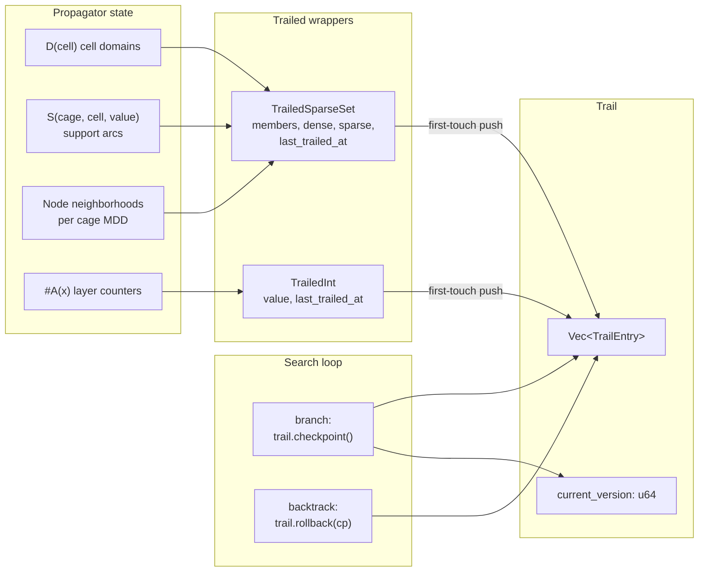

# ADR-0004: Trail-based rollback for constraint propagation state

**Status:** Proposed — pending perf validation
**Date:** 2026-05-31
**Deciders:** Bill McNeill (Mathdoku owner)

## Context

Mathdoku's solver is depth-first search over cell assignments interleaved with constraint propagation. At each search branch the solver fixes a tentative `(cell, value)` choice, runs propagation to fixpoint, and either continues into the subtree or — on contradiction or completion — backtracks to try the alternative. On backtrack every state mutation made on the explored subtree must be undone exactly, so the parent branch sees the same propagator state it saw on the way in.

Today's rollback mechanism is a full grid copy. Before branching, the solver snapshots the entire grid state (cell domains and any propagator-internal bookkeeping); on backtrack it restores the snapshot. This is correct and simple — the state is small enough that copying it costs nothing perceptible on current puzzles — but the cost is O(grid) per branch regardless of how few mutations propagation actually made.

The state surface is about to grow. Once MDD-4R (Perez & Régin 2014, *Improving GAC-4 for Table and MDD Constraints*) lands as the cage propagator, every cage gains its own per-`(cell, value)` `S` lists, per-node incoming/outgoing arc lists, and per-layer arc counters. All of these are mutable sparse sets that propagation deletes from in normal operation and that the algorithm's reset mode wipes en masse. The sparse-set structure (Briggs & Torczon 1993) was chosen specifically because the delete operation is O(1) and *invertible* — swap-to-end-and-decrement leaves the deleted element parked at its original `dense` index, so re-incrementing `members` restores it without touching anything else. The grid-copy approach throws this property away: every backtrack pays for snapshot-and-restore of state the deletions could have restored in O(1).

The puzzle is therefore: replace grid copy with a rollback mechanism whose cost scales with state actually mutated on the branch, without inventing per-data-structure undo logic for every sparse set in the propagator.

## Decision

Introduce a **trail** — a single append-only log of state changes — and a **checkpoint** — an opaque token marking a trail position. The solver calls `Trail::checkpoint` before each branch; on backtrack, `Trail::rollback(checkpoint)` pops every trail entry pushed since that checkpoint and invokes each entry's restore function with its payload.

Every mutable piece of propagator state participates in the trail through a wrapper type.

`TrailedSparseSet` is a Briggs & Torczon sparse set whose `delete`, `re_add`, and `reset_to_zero` operations push a trail entry carrying the pre-mutation `members` value. Restoration is one integer assignment, which is precisely the operation the sparse-set delete was designed to be invertible by.

`TrailedInt` is a single integer slot — for `#A(x)` layer arc counters and other scalar bookkeeping — whose `set` operation pushes a trail entry with the pre-mutation value.

The wrappers carry first-touch-per-branch tracking: each holds a version counter that the `Trail` bumps on every checkpoint, and a mutation pushes a trail entry only if the wrapper's version is behind the trail's current. A long sequence of deletes on the same `S` list within one MDD-4R call therefore trails one entry, not one per delete.

The existing grid-copy backtrack is removed from the search loop and replaced with `trail.rollback(checkpoint)`. The cell-domain type migrates to `TrailedSparseSet`. MDD-4R's `S` lists, node neighborhoods, and layer counters are built on the trailed wrappers from day one.

## Options Considered

### Option A: Trail with `TrailedSparseSet` and `TrailedInt` wrappers — *chosen*

| Dimension | Assessment |
|-----------|------------|
| Complexity | Low — one new module, mechanical wrappers around existing structures |
| Per-branch cost | O(state mutated) — proportional to actual propagation work |
| Per-mutation overhead | One version compare + at most one `Vec::push` |
| Per-backtrack cost | O(mutations trailed since checkpoint) |
| Memory at depth d | O(Σ mutations across active branches) |

**Pros:** Cost scales with what propagation actually did. The sparse-set inversion property is preserved end-to-end — restoration is a single integer assignment per touched set. The wrapper types are the obvious storage for the bookkeeping (`members`, version, current value), so the API stays free of explicit "remember to trail this" calls at the propagator's call sites. MDD-4R can use `TrailedSparseSet` directly without inventing parallel undo machinery for its `S` lists, its node neighborhoods, or its layer counters.

**Cons:** Every sparse-set-typed field in the propagator becomes a trailed wrapper, and reading the source means understanding the wrapper. The first-touch optimization adds a `u64` version field per trailed object, paid even on puzzles trivial enough that grid copy would have been free. The trail is a borrow-checker irritant: methods that mutate trailed state must thread `&mut Trail` through their signatures.

### Option B: Status quo — grid copy at each branch

| Dimension | Assessment |
|-----------|------------|
| Complexity | Lowest — already implemented |
| Per-branch cost | O(grid) regardless of mutation volume |
| Per-mutation overhead | None |
| Per-backtrack cost | O(grid) restore |
| Memory at depth d | O(d × grid) for the snapshot stack |

**Pros:** Already works. No API churn. Behaves identically on shallow puzzles where the constant cost of grid copy is below the noise floor.

**Cons:** The state to be copied grows with MDD-4R. Per-cage `S` lists, per-node arc neighborhoods, and per-layer counters all become part of the snapshot. The Briggs & Torczon delete is O(1) and invertible specifically so that restoration can be O(1) — paying O(total cage state) at every backtrack discards that property. The snapshot stack also forces the propagator to support a deep copy of every mutable data structure, which is mechanical but expanding work.

### Option C: Per-mutation undo log of closures

Each mutation pushes a `Box<dyn FnOnce(&mut PropagatorState)>` onto an undo stack. Backtrack pops and invokes the closures in reverse order.

| Dimension | Assessment |
|-----------|------------|
| Complexity | Low — undo logic lives at the call site |
| Per-mutation overhead | One heap allocation per mutation |
| Per-backtrack cost | O(mutations) + indirect dispatch per closure |
| Type safety | Weaker — each closure captures whatever it likes |

**Pros:** Each call site decides exactly what to undo, with no shared trail data type. Adding a new mutation operation means writing its inverse inline.

**Cons:** Heap allocation on the propagation hot path. An MDD-4R reset that wipes a layer of size k allocates k closures — versus k integer pushes onto a single `Vec` under Option A, which is the same operation at a dozen orders of magnitude lower constant. Undo closures are also opaque to inspection or batching, whereas the trail's fixed-shape entries could in principle be coalesced or replayed.

### Option D: Persistent data structures

Replace every mutable sparse set with an immutable, structurally-shared one (HAMT, balanced tree, or similar). Mutations return new versions; the solver keeps a reference to the parent version on the branch stack; backtrack discards the new version pointer.

| Dimension | Assessment |
|-----------|------------|
| Complexity | High — new data structure for every state type |
| Per-mutation overhead | O(log n) per operation, plus allocation |
| Per-backtrack cost | O(1) pointer swap |
| Memory at depth d | O(structural sharing) — input-dependent |

**Pros:** Conceptually cleanest. Backtrack is a pointer swap. Concurrent search (if ever) becomes nearly free.

**Cons:** Every sparse-set operation goes from O(1) to O(log n) — an asymptotic penalty applied to the propagation hot path in exchange for an asymptotic improvement to a path (backtrack) that is already O(1) per touched set under Option A. The Briggs & Torczon sparse set was selected for O(1) operations and O(1) invertible delete; persistent structures throw both away. There is no off-the-shelf Rust persistent sparse set, so the algorithm-specific delete-and-restore property would have to be reinvented inside whatever persistent structure replaces it.

### Option E: Re-derivation on backtrack

Store nothing at branch entry. On backtrack, return to the parent state by re-running propagation from a known earlier point — the puzzle's initial state, or a saved checkpoint at a higher branch.

| Dimension | Assessment |
|-----------|------------|
| Complexity | Low if the earlier point is the puzzle start |
| Per-branch cost | None |
| Per-backtrack cost | O(full propagation from start) per pop |
| Memory at depth d | O(decisions made so far) |

**Pros:** Trivial against an existing propagator: backtrack is "reset to initial state, replay all the decisions above this level". No rollback machinery anywhere.

**Cons:** Re-running propagation on every backtrack is asymptotically catastrophic. A puzzle of depth d backtracking once at each level pays Θ(d) propagation calls per backtrack and Θ(d²) total. For Mathdoku puzzles where the propagator does the heavy lifting, this is the worst possible pattern; it inverts the cost balance MDD-4R was chosen to achieve.

### Sub-option: First-touch tracking (chosen) vs. trail-every-mutation

Within Option A, the implementation can either push a trail entry on *every* sparse-set mutation, or only on the first mutation of each set since the most recent checkpoint.

Trail-every-mutation is simpler — no version field on the wrappers, no compare-and-skip logic. The cost is one trail entry per mutation rather than per touched set. For MDD-4R's reset mode (one wipe of `members` to zero) this is one entry either way. For deletion mode on an `S` list undergoing k sequential deletes within one propagation call, it is k entries vs. one.

The expected mix from Perez & Régin's experiments is that reset dominates at shallow search depth (where most of an `S` list dies at once) and deletion dominates at deep search depth (where one or two values get removed at a time). Both regimes occur in normal search; the first-touch optimization is the right call. The cost — one `u64` version field per `TrailedSparseSet` — is negligible.

## Trade-off Analysis

The decision is between paying for backtrack proportional to mutation volume (Option A), paying for it proportional to total state size (Option B), or paying for it at all (Option E).

Option A's per-branch cost is the lowest of the three: it sums to the same Θ(mutations) the propagator was going to do anyway, and the per-mutation overhead is one comparison and at most one `Vec::push`. The cost grows only when propagation does real work, which is the property the rest of the propagator stack was already designed around — MDD-4R's reset rule is itself a "do less work when work is large" pattern, and the trail extends that property across the search backtrack boundary.

Option B was acceptable when the propagator state was cell domains alone. It becomes a poor fit the moment MDD-4R lands: copying the entire cage MDD state at every branch discards the O(1) invertibility the sparse-set representation was chosen for. The right time to retire it is before that state arrives, not after.

Option C trades data-structure discipline for per-call-site discipline and pays for it in heap allocations on the propagation hot path. The MDD-4R inner loop is exactly where allocations cost the most.

Option D is the structurally cleanest answer in a vacuum but inverts the cost balance: it adds a `log n` factor to operations the propagator does constantly in exchange for an O(1) factor on operations the propagator does once per branch. With Option A, both sides are already O(1).

Option E is the wrong answer for any propagator with non-trivial setup cost. Mathdoku's propagator is exactly that.

## Consequences

### What becomes easier

MDD-4R's `S` lists, node neighborhoods, and layer counters drop straight into `TrailedSparseSet` and `TrailedInt`. The MDD-4R issue does not have to invent rollback machinery; it inherits it.

The propagator's per-branch and per-backtrack costs become measurable per data structure: every trailed wrapper exposes a count of touched entries, and the trail length at any point is a single integer. Profiling backtrack regressions becomes straightforward.

Reset mode in MDD-4R requires zero special handling in the rollback layer. `reset_to_zero` is just another mutation that trails the pre-reset `members` value; restoration is one assignment. The algorithm's delete-vs-reset decision rule (Property 3 of Perez & Régin) stays a pure local choice with no rollback-side asymmetry.

### What becomes harder

Trailed wrappers thread `&mut Trail` through their signatures. Any function that mutates propagator state has a `Trail` parameter, and so does any function in its call chain. This is mostly mechanical but it is a real shape change to the propagator's API and shows up in every signature that touches state.

Adding a new mutable data structure to the propagator means writing a new trailed wrapper (or extending an existing one), not just a `Vec` field. The Briggs & Torczon sparse set is the structure the trail was designed against; a future structure with a different mutation model needs its own wrapper-with-restore logic.

The trail is not thread-safe and isn't designed to be. If parallel search is ever added, each worker carries its own `Trail`, and the wrappers' version counters need to either become per-worker or thread-local. Multi-worker search is not on the roadmap; recording the assumption here.

### What we'll need to revisit

The first-touch optimization assumes a steady mix of reset and deletion modes. If profiling reveals that one mode dominates so completely that the version-field overhead is pure cost, the wrapper can be simplified to trail-every-mutation without changing the public API.

The trail is a single `Vec<TrailEntry>`. If trail capacity becomes a bottleneck — large MDDs with millions of arcs propagating across deep search trees — a segmented trail (per-checkpoint chunks, reused on backtrack) is the obvious next step. Not worth doing until measured.

Requiring `&mut Trail` in propagator function signatures is the alternative to a `thread_local!` trail singleton. The singleton would simplify the API at the cost of removing the compile-time guarantee that a function which doesn't take `&mut Trail` cannot trail. The current call shape is preferred; if it becomes a sustained source of friction (especially across crate boundaries), the singleton is the fallback.

The diagram below sketches the runtime topology; it is the contract this ADR's implementation must preserve.

## Validation

Grid copy is simpler than the trail in every respect that matters to a code reader: no `&mut Trail` threading through propagator signatures, no version-counter bookkeeping per data structure, no `TrailedSparseSet` wrapper layer, no rollback API to keep correct. The trail's only justification is performance — specifically, that the per-branch cost reduction (O(grid) → O(mutations)) translates into a meaningfully faster solver on representative puzzles.

Before this ADR moves to *Accepted* and the trail is implemented across the propagator, the change must be benchmarked against the grid-copy baseline on a perf bed (designed separately, intended to outlive this experiment). The pass condition is a significant, reproducible solve-time improvement on hard puzzles — the regime where MDD-4R is expected to dominate runtime cost and where rollback volume is highest. If the measured win is modest or absent, the decision reverts to the grid-copy status quo and the trail is not pursued. Simpler beats more complicated absent a real performance reason.

One caveat on the pre-MDD-4R measurement: cell domains are the only sparse sets available to trail before MDD-4R lands, so the delta will be smaller than the full-state delta the design is ultimately motivated by. A reasonable bar is *directional improvement pre-MDD-4R is necessary but not sufficient*; the trail stays provisional until MDD-4R is in place and the comparison can be made against the state surface the trail was actually designed to handle.

## Implementation

Issue filing is deferred until validation is complete. If the perf bed confirms the expected speedup, the work breakdown is filed then as a GitHub issue. If not, this ADR stands as a record of the option for future reconsideration.

## References

- Perez, G. & Régin, J-C. (2014). *Improving GAC-4 for Table and MDD Constraints*. CP 2014.
- Briggs, P. & Torczon, L. (1993). *An efficient representation for sparse sets*. ACM Letters on Programming Languages and Systems 2, 59-69.
